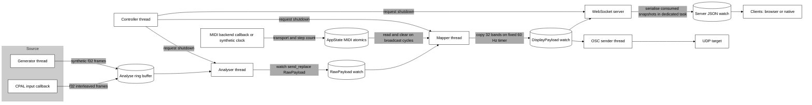
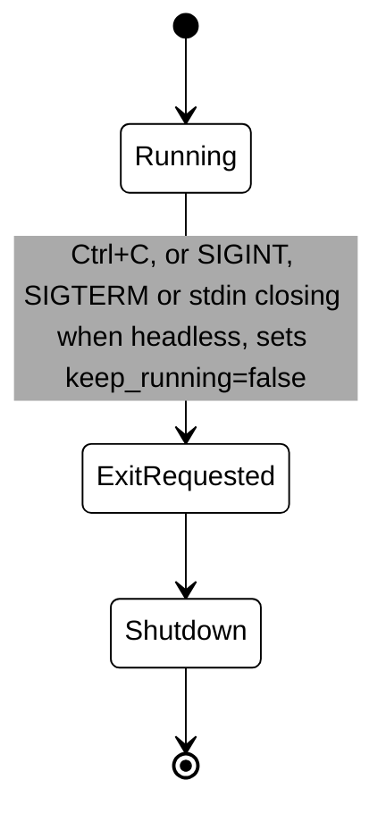
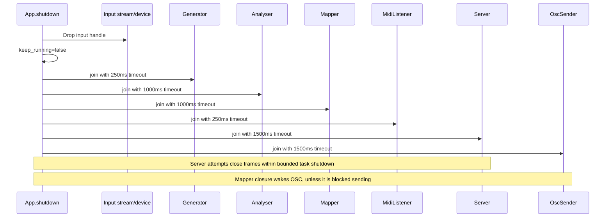

# Phase4 Lifecycle Diagrams

## Buffering and Delivery

The audio sample callback copies selected `f32` samples into a preallocated SPSC ring buffer. It performs no Phase4 heap allocation, logging or waiting for the analyser. The stream error callback is separate and can log. The host audio backend remains outside this callback-level guarantee.

Buffer capacity is calculated from 500 ms of audio at the resolved sample rate and analysed channel count, then rounded up to a power of two. At 48 kHz stereo this gives 65,536 samples, or 256 KiB of sample storage and approximately 683 ms of capacity. That is backlog headroom, not an imposed delay or a guarantee that the backend always meets its deadlines. Capacity stays fixed during capture. Power-of-two rounding does not establish bitmask wrapping in the locked `ringbuf` implementation.

The analyser consumes queued audio in FIFO order. When the buffer is full, the callback drops incoming complete frames and retains older queued audio. This preserves channel order during overflow but introduces gaps in analysis. The capture callback currently discards the overflow indicator, so the output does not report those gaps.

The analyser processes available whole frames in chunks of up to approximately 10 ms and sleeps when empty. Filter and envelope state persists across chunks. The all-channel callback publishes accepted slices together. Selected-channel capture publishes samples individually, and the analyser carries partial frames between reads.

Raw and display payloads use watch channels that retain the latest snapshot rather than a queue of every analysis result. The mapper schedules display publication at 60 Hz and skips missed timer ticks. It can repeat the latest analysis values or skip intermediate analysis chunks. Neither output includes an audio timestamp or sequence number.

The allocation-free, lock-free requirement applies to the sample callback. Downstream watch channels use synchronisation. The analyser and mapper reuse payload storage, the WebSocket serialiser allocates shared JSON text, and OSC reuses the encoding buffer prepared during startup. Resource use depends on sample rate, selected channels and connected clients.

Analysis and display publication run continuously after startup. The controller handles `Ctrl+C` to request shutdown. Under `--headless` there is no controller and no raw mode. The run blocks until SIGINT or SIGTERM arrives or stdin closes, and each requests the same drain. A hardware stream error stops the run and is reported as an error. See [docs/headless.md](headless.md).

Worker handles and their shutdown metadata are stored in one private ordered collection. Startup registers the generator when present, then the analyser, mapper, MIDI input when present and each configured output. Shutdown drains that collection in registration order, preserving each worker's existing timeout and unparking behaviour. A repeated shutdown has no remaining handles to join.

## Startup Lifecycle

OSC startup builds and encodes the bin bundle for the selected channels, then checks its actual size against the supported 65,507-byte UDP payload limit. Oversized bundles return an error before the OSC socket or sender thread is created. Construction failures stop any workers already started. The prepared bundle and encoding buffer move into the sender for reuse.

```mermaid
%%{init: {
	"theme": "base",
	"themeVariables": {
		"background": "#ffffff",
		"fontFamily": "monospace",
		"fontSize": "16px",
		"lineColor": "#000",
		"primaryBorderColor": "#000",
		"primaryColor": "#fff",
		"primaryTextColor": "#000",
		"secondaryColor": "#aaa",
		"tertiaryColor": "#ccc"
	},
	"flowchart": {
		"curve": "basis",
		"htmlLabels": true
	}
}}%%
flowchart TD
		A[main] --> B[Parse CLI args]
		B --> C{--audio-list?}
		C -->|yes| D[List input devices and exit]
		C -->|no| C2{--midi-list?}
		C2 -->|yes| D2[List MIDI input devices and exit]
		C2 -->|no| C5{--headless?}
		C5 -->|yes| E2[Load explicit config or optional config.yaml]
		C5 -->|no| C3{Interactive terminal?}
		C3 -->|no| C4[Exit with interactive-terminal error, non-zero]
		C3 -->|yes| E2
		E2 --> E[Build AppConfig: CLI overrides file, file overrides defaults]
		E --> E3{At least one of --ws-addr, --osc-addr configured?}
		E3 -->|no| E4[Exit: NoOutputConfigured, non-zero]
		E3 -->|yes| F{Calibration mode?}
		F -->|yes| G[Use synthetic specs 44.1kHz, 2ch]
		F -->|no| H[Resolve device and default input configuration]
		G --> H2{Real MIDI input configured?}
		H --> H2
		H2 -->|yes| H3[Resolve and connect MIDI input device]
		H2 -->|no| V[Validate sample-rate limits, filter coefficients and channel indices]
		H3 --> V
		V --> I[Create analyse ring buffer]
		I --> J[Create watch channels: RawPayload and typed DisplayPayload]
		J --> K{Input source}
		K -->|calibration| M[Spawn generator thread]
		K -->|hardware| L[Start CPAL stream callback]
		L --> N[Spawn analyser thread]
		M --> N
		N --> O[Spawn mapper thread]
		O --> O2{MIDI input configured?}
		O2 -->|yes| O3[Spawn MIDI listener thread]
		O2 -->|no| P
		O3 --> P{--ws-addr configured?}
		P -->|yes| P2[Spawn WebSocket server thread]
		P -->|no| Q
		P2 --> Q{--osc-addr configured?}
		Q -->|yes| Q3[Build and encode OSC bin bundle]
		Q3 --> Q4{Encoded payload at most 65,507 bytes?}
		Q4 -->|yes| Q2[Bind UDP socket and spawn OSC sender thread]
		Q4 -->|no| Q5[Stop started workers and return startup error]
		Q -->|no| R[Run interactive controller loop until shutdown]
		Q2 --> R
		R --> S[Shutdown: drop input, signal keep_running=false, join workers with timeouts]
```

## Runtime Data Flow

## Controller State Lifecycle

## Shutdown Ordering and Timeouts

Input stream drop happens before worker joins. The configured grace periods apply to individual worker joins, not the entire shutdown or the device driver's stream-drop operation. Timed-out workers are logged and detached, not forcibly terminated. The join loop repeatedly unparks the real MIDI connection holder so it can release its connection.

Output startup errors use the same shutdown path for workers already started. A WebSocket close frame is attempted during graceful shutdown, with up to 500 ms for remaining server tasks before they are aborted. Delivery of a close frame to every client is not guaranteed.

