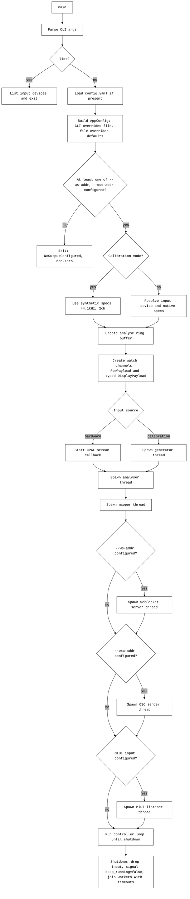
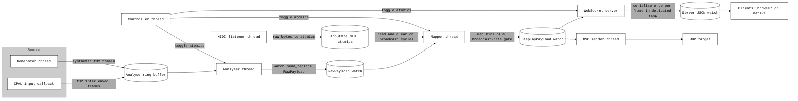
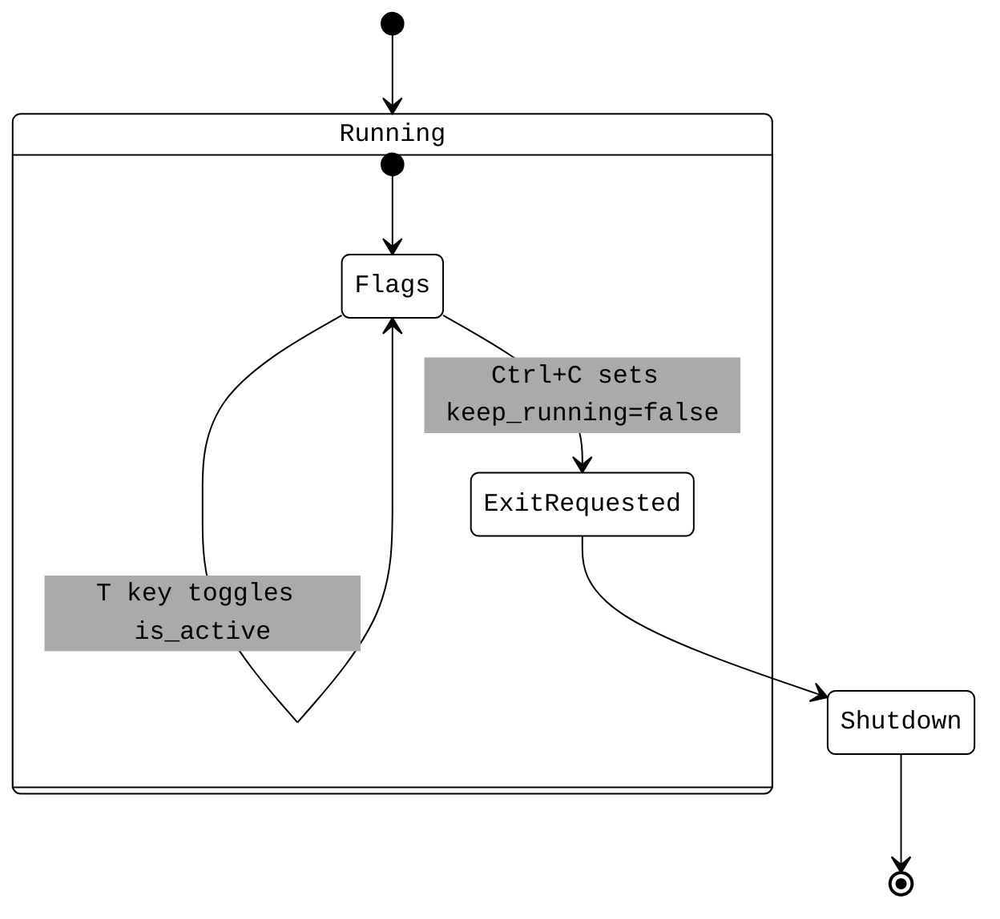
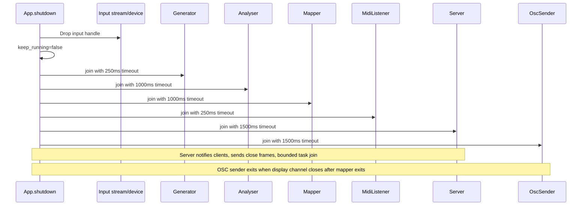

# Phase4 Lifecycle Diagrams

## Startup Lifecycle

```mermaid
%%{init: {
	"theme": "base",
	"themeVariables": {
		"background": "#ffffff",
		"fontFamily": "monospace",
		"fontSize": "16px",
		"lineColor": "#000",
		"primaryBorderColor": "#000",
		"primaryColor": "#fff",
		"primaryTextColor": "#000",
		"secondaryColor": "#aaa",
		"tertiaryColor": "#ccc"
	},
	"flowchart": {
		"curve": "basis",
		"htmlLabels": true
	}
}}%%
flowchart TD
		A[main] --> B[Parse CLI args]
		B --> C{--list?}
		C -->|yes| D[List input devices and exit]
		C -->|no| E2[Load config.yaml if present]
		E2 --> E[Build AppConfig: CLI overrides file, file overrides defaults]
		E --> E3{At least one of --ws-addr, --osc-addr configured?}
		E3 -->|no| E4[Exit: NoOutputConfigured, non-zero]
		E3 -->|yes| F{Calibration mode?}
		F -->|yes| G[Use synthetic specs 44.1kHz, 2ch]
		F -->|no| H[Resolve input device and native specs]
		G --> I[Create analyse ring buffer]
		H --> I
		I --> J[Create watch channels: RawPayload and typed DisplayPayload]
		J --> K{Input source}
		K -->|calibration| M[Spawn generator thread]
		K -->|hardware| L[Start CPAL stream callback]
		L --> N[Spawn analyser thread]
		M --> N
		N --> O[Spawn mapper thread]
		O --> P{--ws-addr configured?}
		P -->|yes| P2[Spawn WebSocket server thread]
		P -->|no| Q
		P2 --> Q{--osc-addr configured?}
		Q -->|yes| Q2[Spawn OSC sender thread]
		Q -->|no| Q3
		Q2 --> Q3{MIDI input configured?}
		Q3 -->|yes| Q4[Spawn MIDI listener thread]
		Q3 -->|no| R[Run controller loop until shutdown]
		Q4 --> R
		R --> S[Shutdown: drop input, signal keep_running=false, join workers with timeouts]
```

## Runtime Data Flow

```mermaid
%%{init: {
	"theme": "base",
	"themeVariables": {
		"background": "#ffffff",
		"fontFamily": "monospace",
		"fontSize": "16px",
		"lineColor": "#000",
		"primaryBorderColor": "#000",
		"primaryColor": "#fff",
		"primaryTextColor": "#000",
		"secondaryColor": "#aaa",
		"tertiaryColor": "#ccc"
	},
	"flowchart": {
		"curve": "basis",
		"htmlLabels": true
	}
}}%%
flowchart LR
		subgraph Source
			A1[CPAL input callback]:::source
			A2[Generator thread]:::source
		end

		A1 -->|f32 interleaved frames| B2[(Analyse ring buffer)]
		A2 -->|synthetic f32 frames| B2

		B2 --> C2[Analyser thread]
		C2 -->|watch send_replace RawPayload| E[(RawPayload watch)]
		E --> F[Mapper thread]
		F -->|map bins plus broadcast-rate gate| G[(DisplayPayload watch)]
		N1[MIDI listener thread] -->|raw bytes to atomics| N2[(AppState MIDI atomics)]
		N2 -->|read and clear on broadcast cycles| F
		G --> H[WebSocket server]
		H -->|serialise once per frame in dedicated task| H2[(Server JSON watch)]
		H2 --> I[Clients: browser or native]
		G --> L[OSC sender thread]
		L --> M[UDP target]

		J[Controller thread] -->|toggle atomics| C2
		J -->|toggle atomics| F
		J -->|toggle atomics| H

```

## Controller State Lifecycle

```mermaid
%%{init: {
	"theme": "base",
	"themeVariables": {
		"background": "#ffffff",
		"fontFamily": "monospace",
		"fontSize": "16px",
		"lineColor": "#000",
		"primaryBorderColor": "#000",
		"primaryColor": "#fff",
		"primaryTextColor": "#000",
		"secondaryColor": "#aaa",
		"tertiaryColor": "#ccc"
	}
}}%%
stateDiagram-v2
		[*] --> Running

		state Running {
			[*] --> Flags
			Flags --> Flags: T key toggles is_active
			Flags --> ExitRequested: Ctrl+C sets keep_running=false
		}

		ExitRequested --> Shutdown
		Shutdown --> [*]
```

## Shutdown Ordering and Timeouts

```mermaid
sequenceDiagram
		participant Main as App.shutdown
		participant In as Input stream/device
		participant Gen as Generator
		participant An as Analyser
		participant Map as Mapper
		participant Midi as MidiListener
		participant Srv as Server
		participant Osc as OscSender

		Main->>In: Drop input handle
		Main->>Main: keep_running=false

		Main->>Gen: join with 250ms timeout
		Main->>An: join with 1000ms timeout
		Main->>Map: join with 1000ms timeout
		Main->>Midi: join with 250ms timeout
		Main->>Srv: join with 1500ms timeout
		Main->>Osc: join with 1500ms timeout

		note over Main,Srv: Server notifies clients, sends close frames, bounded task join
		note over Main,Osc: OSC sender exits when display channel closes after mapper exits
```
