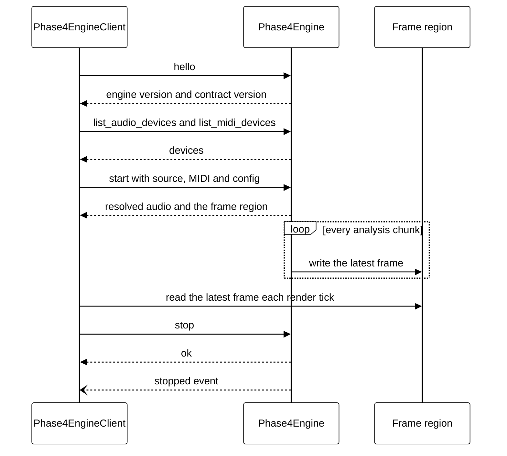

# XPC Service

On macOS, Phase4 can run as an XPC service, `Phase4Engine.xpc`, embedded in the Phase4 macOS app. The service implements version 1 of the Phase4Engine link contract: XPC requests and replies for control, XPC events for the engine's lifecycle, and a shared memory frame region that receives every analysis snapshot together with the MIDI state.

The service is macOS only. It never opens the WebSocket or OSC outputs, and the interactive and headless modes are unchanged. The same contract is documented in the Phase4 app repository as `docs/link-contract.md`, and the two copies change together.

## Building the Bundle

```sh
./scripts/build-xpc.sh
```

The script builds the `phase4-xpc` binary in release, then assembles `target/xpc/Phase4Engine.xpc` from `resources/xpc/Info.plist` with the package version, and prints the bundle path. The bundle identifier is `com.rayboyd.Phase4.Engine`.

The bundle is unsigned. The Phase4 app signs it with its own entitlements, including audio input, when it embeds it. launchd starts the service when the app first connects, with no arguments, so `phase4-xpc` does not parse the command line. Run by hand, it prints `An XPC Service cannot be run directly.` and aborts.

## Overview



## Messages

Every message is an XPC dictionary. Keys are snake case, matching Phase4's JSON. Every message carries two keys.

| Key | XPC type | Meaning |
| --- | --- | --- |
| `v` | int64 | The contract version, `1` |
| `type` | string | The request or event name |

A request is sent with a reply expected. Every reply carries `v` and `ok`, a bool. A successful reply carries the fields listed for its request. A failed reply carries `error`, a dictionary with `code` and `message`, both strings.

Optional fields are left out of the dictionary when they have no value. Neither side sends an explicit null.

## Requests

### hello

Sent first on every new connection. The engine checks `v` on every request and replies `ContractMismatch` when it does not support that version.

| Reply field | XPC type | Meaning |
| --- | --- | --- |
| `engine_version` | string | The package version, such as `0.0.21` |
| `contract_version` | int64 | The contract version the engine speaks |
| `band_count` | int64 | Always `32` |

### list_audio_devices

| Reply field | XPC type | Meaning |
| --- | --- | --- |
| `devices` | array of dictionaries | Input devices in the host's enumeration order |
| `devices[].name` | string | The device name |
| `devices[].sample_rate` | int64, optional | Hardware sample rate in Hz, left out when it cannot be queried |
| `devices[].channels` | int64, optional | Hardware input channel count, left out when it cannot be queried |
| `devices[].supported` | bool | Whether the default configuration is `f32`, which Phase4 requires |

### list_midi_devices

| Reply field | XPC type | Meaning |
| --- | --- | --- |
| `devices` | array of dictionaries | MIDI input devices in enumeration order |
| `devices[].name` | string | The device name |

### start

Starts analysis. It is valid only while the engine is idle, and replies `AlreadyRunning` otherwise.

| Request field | XPC type | Meaning |
| --- | --- | --- |
| `source` | dictionary | What to analyse, described below |
| `midi` | dictionary, optional | MIDI input, described below. Left out means no MIDI |
| `config_yaml` | string, optional | The full text of the tuning config. Left out means Phase4's defaults |

The `source` dictionary has a `kind` and the fields for that kind.

| `kind` | Fields | Meaning |
| --- | --- | --- |
| `device` | `device_name` string, `channels` array of int64, optional | A device from `list_audio_devices` by its exact name. `channels` holds zero-based hardware channel indices, and leaving it out analyses every channel |
| `test_tone` | `hz` double | A fixed calibration tone, above 0 and at most 19,845 Hz |
| `test_sweep` | `rate_hz` double | A calibration sweep, above 0 and at most 19,845 Hz |

The `midi` dictionary has a `kind` and the fields for that kind.

| `kind` | Fields | Meaning |
| --- | --- | --- |
| `device` | `device_name` string | A device from `list_midi_devices` by its exact name |
| `test_clock` | `bpm` double | A synthetic MIDI clock, finite and above 0 |

`config_yaml` is validated exactly as a [config file](config.md) is, and a failure replies with the same error code. The `network` section is ignored, because the service never opens network outputs. The request's `source` and `midi` override the config's `audio` and `midi` sections, as the command line overrides a config file.

| Reply field | XPC type | Meaning |
| --- | --- | --- |
| `audio_device` | string, optional | The device the name resolved to, left out for a calibration signal |
| `sample_rate` | int64 | The sample rate in Hz |
| `channels` | array of int64 | The analysed hardware channel indices, in frame order |
| `midi_device` | string, optional | The resolved MIDI device, left out when MIDI is off or is the test clock |
| `frames` | shared memory | The frame region for this run |
| `frame_bytes` | int64 | The number of bytes of the region the layout uses |

### stop

Stops analysis and replies once the engine's workers have drained. It is valid in any state and does nothing while idle. After stopping a run, the engine sends a `stopped` event once the reply is on its way.

## Events

The engine sends events on its connection to the client without expecting a reply.

| Event | Fields | Meaning |
| --- | --- | --- |
| `error` | `code` string, `message` string | The run failed, for example `HardwareStreamError` when an interface is unplugged. A `stopped` event follows |
| `stopped` | `reason` string | The engine stopped. `reason` is `requested` after `stop` and `failed` after an `error` event |

A client treats an unrecognised event as something to ignore, and an unrecognised `stopped` reason as a clean stop.

## Errors

`code` is a stable identifier and `message` is prose for people. A client acts on `code` and shows `message`. It treats an unrecognised code as a generic failure.

- The [headless](headless.md#error) codes carry over unchanged, including `MissingDevice`, `NoMatch`, `UnsupportedFormat`, `ChannelIndexOutOfRange`, `MidiUnavailable`, `MidiNoMatch`, `MidiConnectFailed`, `HardwareStreamError` and `Unknown`, and the config validation codes.
- The link adds `ContractMismatch`, `InvalidRequest` for a missing or mistyped field or an unknown request `type`, and `AlreadyRunning`.

Adding a code does not change the contract version. Renaming or removing one does.

## Frame Region

The engine creates a new region for each run in anonymous `MAP_SHARED` memory and sends it in the `start` reply as an XPC shared memory object. The client maps it read only. The region belongs to that run, and the client unmaps it after `stopped`, after a failed `start` or when the connection is interrupted.

All values are little endian. Floats are IEEE 754 binary32. Offsets are in bytes.

| Offset | Type | Field | Written |
| --- | --- | --- | --- |
| 0 | 4 bytes | `magic`, the ASCII bytes `P4FR` | Once |
| 4 | u32 | `layout_version`, `1` | Once |
| 8 | u64 | `sequence` | Every frame |
| 16 | u64 | `published_ns`, the `CLOCK_UPTIME_RAW` time in nanoseconds when the frame was written | Every frame |
| 24 | u32 | `channel_count` | Once |
| 28 | u32 | `band_count`, `32` | Once |
| 32 | u32 | `sample_rate` in Hz | Once |
| 36 | u32 | `midi_flags`, bit 0 set when MIDI input is configured | Once |
| 40 | u32 | `midi_steps`, MIDI 1/16 note steps since the last Start, wrapping at 2^32 | Every frame |
| 44 | u32 | `midi_transport_count`, which goes up by one for every Start, Stop or Continue received, wrapping at 2^32 | Every frame |
| 48 | u32 | `midi_transport_last`, `0` for none, `1` Start, `2` Stop, `3` Continue | Every frame |
| 52 | 12 bytes | Reserved, zero | Once |
| 64 | channel records | One record per analysed channel, in the order of the `start` reply's `channels` | Every frame |

Each channel record is 132 bytes: `peak` as an f32 at its offset 0, then `bins` as 32 f32 values from low to high frequency. Channel `i` starts at `64 + i * 132`. `frame_bytes` is `64 + channel_count * 132`, and the region is that size rounded up to a whole number of pages.

Fields marked Once are written before the region is sent and never change.

### Publication

- The frame writer publishes a frame for every analysis snapshot, about every 10 ms. It reads the analyser's snapshots directly and does not resample to the mapper's 60 Hz display rate.
- The MIDI fields hold the latest MIDI state at the moment of publication. `midi_steps` and `midi_transport_count` are running totals, so a client that skips frames loses no steps and can tell how many transport events it missed. Only the kind of the most recent event is kept. The mapper's read-and-clear of the transport event for the network outputs does not affect them.
- The engine never publishes a snapshot containing a non-finite peak or bin. It skips that snapshot and logs the first skip of a run.

### Sequence

`sequence` is a sequence lock. Zero means no frame has been published yet. It is odd while a frame is being written and even when the frame is stable, so the first frame leaves it at 2.

The writer does this for each frame:

1. Store `sequence + 1`, which is odd, then issue a release fence.
2. Write `published_ns`, the MIDI fields and every channel record with relaxed atomic stores.
3. Store `sequence + 2`, which is even, with release ordering.

The reader does this for each render tick:

1. Load `sequence` with acquire ordering. If it is zero there is no frame yet. If it is odd, try again.
2. Copy `published_ns`, the MIDI fields and every channel record with relaxed atomic loads.
3. Issue an acquire fence, then load `sequence` again. If it has changed, try again.
4. After three failed attempts in one tick, keep the previous frame.

Every payload word is a 32-bit or 64-bit value read and written atomically, so the lock never relies on a data race. `phase4::frames` implements both sides.

## Service Behaviour

- The service serves one client. A second connection while one is active is cancelled, and the first client's run continues.
- When the client's connection closes, or the runtime reports that termination is imminent, the engine stops and drains without sending events, as a headless run does when stdin closes.
- A successful `start` begins an XPC transaction and the end of the run ends it, so the system does not end the service while it streams between messages.
- A monitor checks the running engine every 50 ms. When the engine stops itself, for example on a hardware stream error, it sends `error` and then `stopped` with reason `failed`.

## Logging

The service logs through `syslog(3)` under the ident `Phase4Engine`, which the unified log collects. A panic is logged the same way before the process aborts.

```sh
log stream --predicate 'process == "Phase4Engine"'
```

## Testing

The service tests run in process over an anonymous XPC listener, so they exercise the whole contract without launchd or a bundle. They build only on macOS, so the Linux CI job does not run them, and the pre-push hook runs them on a Mac.

```sh
cargo test --lib xpc
cargo test --lib frames
```
